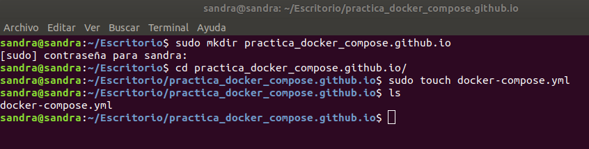

# Práctica Docker Compose

**Enlace a github pages** 

https://sanesga.github.io/practica_docker_compose.github.io/

***


***

**Docker Compose** es una herramienta para definir y ejecutar las aplicaciones Docker de múltiples contenedores. Su funcionamiento se basa en una plantilla (docker-compose.yml). Dicha plantilla, es un fichero YAML que contiene la configuración necesaria para crear cada contenedor y cuya estructura y variables utilizadas en esta práctica, vemos a continuación:

```
version:

services:

 nombreDelServicio:
  image:
  container_name:
  environment:
  ports:
  volumes:
  restart:
  networks:
  depends_on:
  healthcheck:
   test:
   interval:
   timeout:
   retries:
  ulimits: *solo utilizado en ElasticSearch
   memlock:
    soft:
    hard:
  logging: * solo utilizado en WordPress
   driver:
   options:
     gelf-address:
     tag:

networks:
 
volumes: 
```

**VARIABLES**

- **version**: Especifica la versión del fichero de docker-compose que se está utilizando. En función de la versión, la sintaxis del fichero, puede cambiar. Versiones disponibles actualmente:

  

  Utilizaremos la versión 3.

- **services:** Contiene cada contendor con sus variables de configuración.

- **nombreDelServicio:** Nombre del servicio que vamos a crear.

- **image:** Nombre de la imagen y tag que queremos descargar y/o utilizar (si ya la tenemos descargada) para crear el contenedor.

- **container_name:** Nombre que le asignaremos al contenedor creado.

- **environment:** Las variables de entorno del contenedor que se va a crear. Se explican más adelante para cada contendor.

- **ports:** A la izquierda especificaremos el puerto por el que escucha la máquina y a la derecha por donde se expone el contenedor (puede ser el mismo). Podemos especificar tantas parejas de puertos como necesitemos (Ejemplo: "3307:3306"). Para los puertos udp la sintaxis será - "12201:12201/udp".

- **volumes:** Permite crear un volumen para el contenedor. Un contenedor puede tener varios volúmenes y este/os volúmen/es pueden ser compartidos por varios contenedores. Ejemplo de sintaxis: - ./wordpressVol:/var/www/html. A la izquierda especificamos la ruta donde queremos crear el volumen en el host y a la derecha la ruta de los archivos a mapear del contenedor. En nuestro caso, crearemos todos los volúmenes en el mismo directorio que el docker-compose.yml.

- **restart:** Establece la política de reinicio del servicio en caso de que este se detenga. Puede adquirir los valores: 

  - no: Valor por defecto. Si el servicio se detiene, no se reiniciará.
  - always: Se reiciniciará siempre.
  - on-failure: Se reiniciará si se detiene debido a un fallo.
  - unless-stopped: Se reiniciará siempre, a menos que se haya detenido de manera intencionada.

- **networks:** Permite especificar nuestra propia red para que pueda ser utilizada por los distintos contenedores. Se creará automáticamente.

- **depends_on:** Permite especificar una dependencia entre servicios.

- **healthcheck:** Se trata de un test para verificar que el contenedor esté arrancado. Se explican más adelante para cada contenedor. Valores:

  - test: El test que se realizará sobre el contenedor para saber si está correctamente arrancado.
  - interval: El intervalo de tiempo entre dos healthchecks. El valor por defecto son 30 segundos.
  - timeout: El límite de tiempo para ejecutar el test. El valor por defecto son 30 segundos.
  - retries: Las veces que se reintentará el test si este falla. El valor por defecto son 5 segundos.

- **ulimits:**
  - memlock: Límite de memoria que puede utilizar el contenedor.
    - soft: -1
    - hard: -1

  En nuestro caso el valor para ambos será -1, lo que significa que no establecemos ningún límite y puede utilizar memoria ilimitadamente.

- **logging:** Variables que permitirán mostrar los logs de WordPress a través de GreyLog.

  - driver: "gelf" : Tipo de driver utilizado.
  - options:
    - gelf-address: "udp://localhost:12201": Dirección a la cual se conectará para mostrar los logs. 
    - tag: "primeros_logs" :Nombre asignado a los logs.

- **networks** y **volumes** del pie del archivo: Especificamos la red y los volúmenes compartidos por los containers.
    
***

**COMANDOS ÚTILES PARA LA PRÁCTICA**

Lanzar los servicios:

```
sudo docker-compose up
```

Parar todos los contenedores:

ctr+c

Borrar todos los contenedores parados:

```
sudo docker container prune
```

Borrar todos los volúmenes:

```
sudo docker volume prune
```

Ver todos los volúmenes:

```
sudo docker volume ls
```

***

**OBJETIVO DE LA PŔACTICA**

Crear un sistema de monitorización de logs en Graylog para un WordPress

***

Creamos un directorio nuevo para albergar la práctica en la ruta /home/sandra/Escritorio

```
sudo mkdir practica_docker_compose.github.io
```

Creamos el archivo docker-compose.yml en el directorio:

```
sudo touch docker-compose.yml
```




A continuación iremos editando el archivo, añadiendo los servicios necesarios y las variables de configuración especificadas en el enunciado de la práctica.


**1. ELASTIC SEARCH**

<p align="center">

</p>

Añadimos al fichero docker-compose.yml la configuración para Elasticsearch. **Elasticsearch** es un motor open source de analítica y análisis distribuido, para todo tipo de datos. Por su capacidad de indexar muchos tipos de contenido, es utilizado en búsquedas, analíticas de log, monitoreo de rendimiento, etc.

  

Todas las variables están explicadas en la introducción de la práctica. A continuación explicamos las que son específicas de este contenedor:

- Variables de entorno:

   - http.host=0.0.0.0 : Dirección de enlace para peticiones entrantes.
   - network.host=0.0.0.0: Dirección de la red del host.
   - transport-host=0.0.0.0: Dirección a través de la cual se establece la comunicación entre nodos.
   - "ES_JAVA_OPTS=-Xmx256m -Xms256m": Configuración de la memoria dinámica asignada.

- Healthcheck:

   - test: ["CMD", "curl", "-f", "http://0.0.0.0:9200"]: El comando curl -f verifica la conectividad a la URL indicada.

Elasticsearch utiliza un directorio mmapfs para guardar sus índices. Por defecto los sistemas operativos tienen el límite de memoria virtual de mmap demasiado bajo y si no lo incrementamos, nos aparecerá un error de falta de memoria, por lo tanto, seguiremos estos pasos para aumentar este límite en Linux:

Modificamos el archivo sysctl.conf ubicado en el directorio /etc, añadiendo la siguiente línea: 

```
vm.max_map_count=262144
```


Una vez añadida, recargamos la configuración:

```
sudo sysctl -p
```

Ahora, ya podemos lanzar nuestro contenedor. Desde terminal vamos a la carpeta donde se encuentra el archivo docker-compose.yml y ejecutamos:

```
sudo docker-compose up
```

Si nos aparece el siguiente error: 

```
org.elasticsearch.bootstrap.StartupException: java.lang.IllegalStateException: Failed to create node environment
```

tendremos que darle permisos al volumen creado en el directorio de la práctica.

```
sudo chmod 777 -R practica_docker_compose.github.io
```

Verificamos que el container se ha creado y está funcionando correctamente:

```
sudo docker ps -a
```


Podemos observar que el estado del container es healthy, porque ha superado el healthcheck.

Si vamos a localhost:9200, verificamos que está funcionando:


Verificamos que se ha creado el volumen:


***

**2. MONGO DB**

<p align="center">

</p>

Añadimos al fichero docker-compose.yml la configuración para mongoDB. **MongoDB** es un sistema de base de datsos NoSQL orientado a documentos de código abierto.

  

Todas las variables están explicadas en la introducción de la práctica. A continuación explicamos las que son específicas de este contenedor:

- healthcheck:
   -  test: echo 'db.runCommand("ping").ok' | mongo mongo:27017/test --quiet: Hace un ping para verificar la conectividad.


Paramos el contenedor anterior con ctrl+c y volvemos a ejecutar el comando:

```
sudo docker-compose up
```

Verificamos que el container se ha creado y está funcionando correctamente:

```
sudo docker ps -a
```


Podemos observar que el estado del container es healthy, porque ha superado el healthcheck.

Si vamos a localhost:27017, verificamos que está funcionando:


Podemos acceder interactivamente al container ejecutando los siguiente comandos:

```
sudo docker exec -it mongo
```

Una vez hemos accedido:

```
show databases;
```


Verificamos que se ha creado el volumen:


***

**3. GRAYLOG**

<p align="center">

</p>

Añadimos al fichero docker-compose.yml la configuración para graylog. **Graylog** es una plataforma que permite la gestión de registros de datos estructurados y no estructurados junto con aplicaciones de depuración. Se basa en Elasticsearch, MongoDB y Scala.

  

Todas las variables están explicadas en la introducción de la práctica. A continuación explicamos las que son específicas de este contenedor:

- Variables de entorno:

   - GRAYLOG_PASSWORD_SECRET=graylogpasswordsecret: Establecemos una constraseña de mínimo 16 carácteres.
   - GRAYLOG_ROOT_PASSWORD_SHA=8c6976e5b5410415bde908bd4dee15dfb167a9c873fc4bb8a81f6f2ab448a918: Para obtener el código SHA, ejecutamos el siguiente comando en terminal:

     ```
     echo -n "Enter Password: " && head -1 </dev/stdin | tr -d '\n' | sha256sum | cut -d" " -f1
     ```
     Nos pide la contraseña establecida en la variable anterior y nos devuelve el código.

   - GRAYLOG_HTTP_EXTERNAL_URI=http://127.0.0.1:9000/: La dirección a través de la cual se establecerá la conexión.

Paramos los contenedores anteriores con ctrl+c y volvemos a ejecutar el comando:

```
sudo docker-compose up
```

Verificamos que el container se ha creado y está funcionando correctamente:

```
sudo docker ps -a
```


Si vamos a localhost:9000, verificamos que está funcionando:


Hacemos login con el usuario admin y la contraseña admin:


Verificamos que se ha creado el volumen:


***

**4. MYSQL**

<p align="center">

</p>

Añadimos al fichero docker-compose.yml la configuración para MySQL. **MySQL** es un sistema de gestión de bases de datos relacional.

  

Todas las variables están explicadas en la introducción de la práctica. A continuación explicamos las que son específicas de este contenedor:

- Variables de entorno:

   - MYSQL_ROOT_PASSWORD: 12345678: Contraseña del usuario root.
   - MYSQL_DATABASE: wordpress: Nombre de la base de datos que creamos.
   - MYSQL_USER: wordpress: Nombre del usuario que creamos.
   - MYSQL_PASSWORD: wordpress: Contraseña del usuario.

- Healthcheck:
   - test: "/usr/bin/mysql --user=wordpress --password=wordpress --execute \"SHOW DATABASES;\"": Entra a mysql con el usuario y la contraseña designados y realiza una consulta de las bases de datos. Si se realiza con éxito, pasa el test y muestra healthy en el estado.


Paramos el contenedor anterior con ctrl+c y volvemos a ejecutar el comando:

```
sudo docker-compose up
```

Verificamos que el container se ha creado y está funcionando correctamente:

```
sudo docker ps -a
```


Podemos observar que el estado del container es healthy, porque ha superado el healthcheck.

Para verificar que está funcionando, accedemos al container interactivamente a través de los siguientes comandos:

```
sudo docker exec -it mysql mysql -p
```

Nos pide la contraseña que hemos indicado en la variable de entorno MYSQL_ROOT_PASSWORD (12345678).

Una vez hemos accedido:

```
show databases;
```

Y observamos que se ha creado la base de datos wordpress:


Verificamos que se ha creado el volumen:


***


**5. WORDPRESS**

<p align="center">

</p>

Añadimos al fichero docker-compose.yml la configuración para Wordpress. **WordPress** es una plataforma para la creación de blogs, tiendas online y sitios web en general.

  

- Variables de entorno:

  - WORDPRESS_DB_HOST: mysql:3306: Base de datos a la que se conecta y el puerto.
  - WORDPRESS_DB_USER: wordpress: Nombre de usuario de WordPress.
  - WORDPRESS_DB_PASSWORD: wordpress: Contraseña de WordPress.
  - WORDPRESS_DB_NAME: wordpress: Nombre de la base de datos que utilizaremos (la que hemos creado en el contenedor de mysql).

Paramos los contenedores anteriores con ctrl+c y volvemos a ejecutar el comando:

```
sudo docker-compose up
```

Verificamos que el container se ha creado y está funcionando correctamente:

```
sudo docker ps -a
```


Si vamos a localhost:9090, verificamos que está funcionando:


Tras elegir el idioma, rellenamos el siguiente formulario:


Nos informa que WordPress se ha instalado correctamente:


Accedemos al sitio con el usuario y la contraseña que hemos indicado en el formulario anterior (wordpress, wordpress).


Y nos muestra el nuestro sitio de prueba:


Para verificar que está correctamente conectado a nuestra base de datos mysql, vamos a Herramientas -- Salud del sitio -- Información -- Base de datos y obtenemos toda la información de nuestra base de datos:


Verificamos que se ha creado el volumen:


***

**6. VERIFICAR QUE LOS LOGS DE WORDPRESS SE MUESTRAN EN GRAYLOG**

Vamos a añadir un input global de tipo gelf udp en Greylog:

- Accedemos a la página de Greylog en localhost:9000

- En el menú de la página principal, accedemos a System -- Inputs y seleccinamos el input GELF UDP:

  

- Rellenamos el formulario:

  Hacemos check en global, añadimos un título y cambiamos el puerto. El puerto que especificamos debe ser el mismo que hemos indicado en el servicio de Graylog como UDP y el mismo que hemos indicado para la configuración de gelf-address en Wordpress en nuestro docker-compose.yml.

  

- Se nos muestra el input creado:

  

- A continuacióń vamos a la página de Search y observamos que no tenemos logs:

  

- Sin embargo, si accedemos a WordPress (localhost:9090) y actualizamos la página de Graylog, ya podremos ver que se han creado logs:

  

- En el menú de la izquierda, podemos filtrar los logs según queramos ver más o menos información:

  

- Y en la parte superior podemos ver el histograma:

  

***

**VERSIÓN COMPLETA DEL DOCKER-COMPOSE.YML**

```
version: "3"

services:

#Elasticsearch
 elasticsearch:
  image: docker.elastic.co/elasticsearch/elasticsearch-oss:6.8.2
  container_name: elasticSearch
  environment:
   - http.host=0.0.0.0
   - network.host=0.0.0.0
   - transport-host=0.0.0.0
   - "ES_JAVA_OPTS=-Xmx256m -Xms256m"
  ports:
   - "9200:9200"
   - "9300:9300"
  volumes:
   - ./elasticVol:/usr/share/elasticsearch/data
  networks:
   - practica_network
  healthcheck:
   test: ["CMD", "curl", "-f", "http://0.0.0.0:9200"]
   interval: 30s
   timeout: 10s
   retries: 5 
  ulimits:
   memlock:
     soft: -1
     hard: -1

#Mongo
 mongo:
  image: mongo:3
  container_name: mongo
  volumes:
   - ./mongoVol:/data/db
  ports:
   - "27017:27017"
  networks:
   - practica_network
  healthcheck:
   test: echo 'db.runCommand("ping").ok' | mongo mongo:27017/test --quiet
   interval: 30s
   timeout: 10s
   retries: 5 

#Graylog
 graylog:
  image: graylog/graylog:3.1
  container_name: graylog
  environment:
   - GRAYLOG_PASSWORD_SECRET=graylogpasswordsecret
   - GRAYLOG_ROOT_PASSWORD_SHA=8c6976e5b5410415bde908bd4dee15dfb167a9c873fc4bb8a81f6f2ab448a918
   - GRAYLOG_HTTP_EXTERNAL_URI=http://127.0.0.1:9000/
  volumes:
   - ./grayVol:/usr/share/elasticsearch/data
  restart: on-failure
  networks:
   - practica_network
  ports:
   - "9000:9000"
   - "12201:12201/udp"
   - "12201:12201"
   - "1514:1514"
   - "1514:1514/udp"
  depends_on:
   - elasticsearch
   - mongo

 #Mysql
 mysql:
  image: mysql:5.7
  container_name: mysql
  volumes:
   - ./mysqlVol:/var/lib/mysql
  environment:
   MYSQL_ROOT_PASSWORD: 12345678
   MYSQL_DATABASE: wordpress
   MYSQL_USER: wordpress
   MYSQL_PASSWORD: wordpress
  networks:
   - practica_network
  healthcheck:
   test: "/usr/bin/mysql --user=wordpress --password=wordpress --execute \"SHOW DATABASES;\""
   interval: 30s
   timeout: 10s
   retries: 5

 #Wordpress
 wordpress:
  image: wordpress:latest
  container_name: wordpress
  volumes:
   - ./wordpressVol:/var/www/html
  restart: on-failure
  environment:
   WORDPRESS_DB_HOST: mysql:3306
   WORDPRESS_DB_USER: wordpress
   WORDPRESS_DB_PASSWORD: wordpress
   WORDPRESS_DB_NAME: wordpress
  networks:
   - practica_network
  ports:
   - "9090:80"
  logging:
   driver: "gelf"
   options:
    gelf-address: "udp://localhost:12201"
    tag: "primeros_logs"
  depends_on:
   - mysql

networks:
 practica_network:

volumes: 
 elasticVol:
 mongoVol:
 graylogVol:
 mysqlVol:
 wordpressVol:
```
***